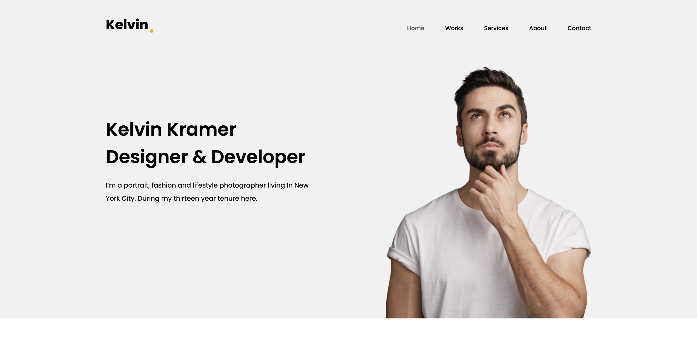
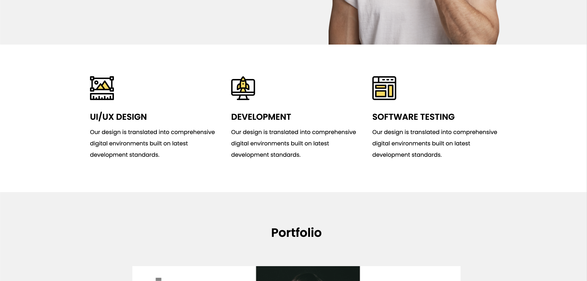
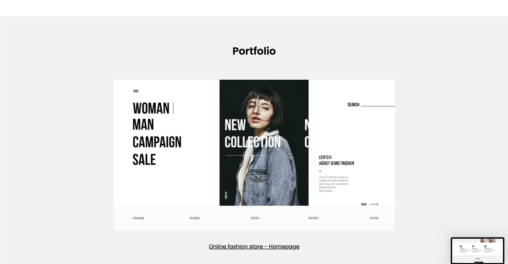

# Landing Page для порфолио 

**Описание:**  
Элегантный и современный лендинг для порфолио (не мое).

---
## Скриншоты приложения

<div align="center">

### Главный экран десктопной версии


### Раздел с сайтами


### Контактная информация


</div>

---

## Установка и запуск

1. Клонируйте репозиторий:
   ```bash
   git clone https://github.com/TsoyIgorDev/landing-portfolio.git
   ```

2. Перейдите в папку проекта:
   ```bash
   cd landing-portfolio
   ```

3. Откройте файл `index.html` в браузере или используйте Live Server:
   ```bash
   # Если у вас установлен Live Server
   npx live-server
   ```

Альтернативно, вы можете разместить файлы на любом веб-сервере.

---

## Технологии

- **HTML5** - Семантическая разметка
- **CSS3** - Современные стили и анимации

---
